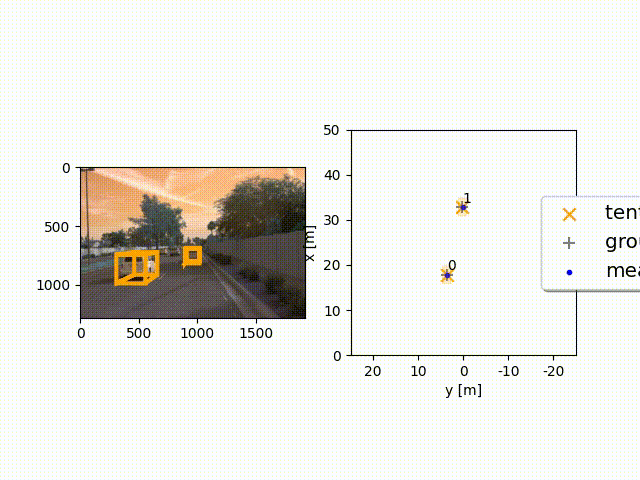
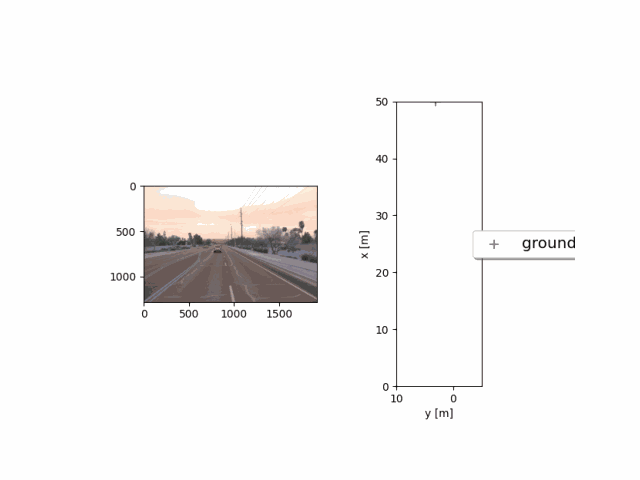
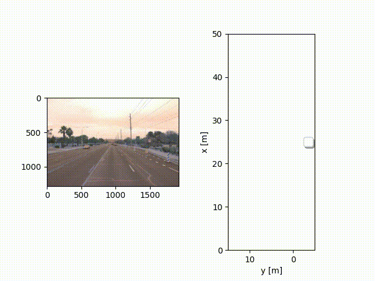
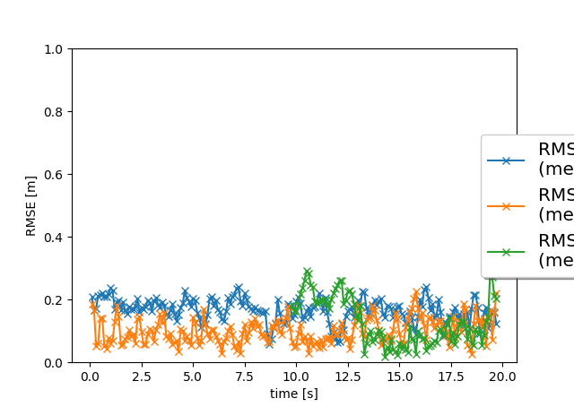

# Project: Multi-Target Tracking with Extended Kalman Filter
## Final Report

## Introduction

In this project, we implemented a multi-target tracking system capable of detecting and tracking vehicles over time using the `Waymo Open Dataset`. The tracking pipeline used a Single Nearest Neighbor (SNN) algorithm with validation gating to improve both runtime and accuracy. The system relied on coordinate transformations between LiDAR and camera sensor frames, particularly for RGB data, which required handling a non-linear measurement model.

To evaluate the results of our multi-target tracking system, we extracted real-world 3D LiDAR detections and RGB images from the `Waymo Open Dataset`. We fused 3D LiDAR detections with camera-based 2D bounding boxes from our `3D_Object_Detection_With_LiDAR_Data` mid-term project and assessed tracking performance in real-world driving scenes. Our results demonstrated that the system can track multiple objects reliably and highlight the impact of different components in the pipeline.

## Extended Kalman Filter (EKF)

The `Extended Kalman Filter`(EKF) was used to predict and update an object's state over time based on incoming sensor measurements. It handled non-linear measurement models—such as those from RGB cameras—by linearizing them using the Jacobian of the measurement function $h(\mathbf{x})$, expanded via a multivariate `Taylor series` about the current state estimate.

We implemented the predict and update steps in `filter.py`, which were executed at every time step when a new measurement became available. This iterative process improved estimates of an object’s position and velocity.

## Multi-Target Tracking (MTT)
In order to successfully track multiple objects over time, the system includes `data association` and `track management`. In the `data association` task, incoming measurement are assigned to a new track instance. A track refers to a variable which encapsulates a state estimate and its covariances, together with a set of tracking attributes that describe the quality of the track prediction. In the `track management` task tracks were initialized, confirmed, and deleted based on the track score. 

### Data Association

In the data association module, incoming measurements from LiDAR or camera were matched with existing tracks using the `Mahalanobis distance` — a metric that accounts for uncertainty in both the predicted track and the measurement:

$$
D^2 = (\mathbf{z} - \mathbf{h}(\mathbf{x}))^\top S^{-1} (\mathbf{z} - \mathbf{h}(\mathbf{x}))
$$

This helped improve association accuracy over simpler methods like Euclidean distance. We also applied validation gating to exclude improbable associations, enhancing robustness and efficiency.

### Track Management
The track management module was responsible for initializing, confirming, and deleting tracks. New tracks were initialized from LiDAR detections, and a scoring system based on recent detection history determined whether a track should be maintained or removed.

The track score was computed as:

$$
\text{track score} = \frac{\text{detections in last } n \text{ frames}}{n}
$$

This score reflected the consistency of a track being associated with valid detections. A high score indicated a reliable track, while a low score suggested a false positive or a vehicle that had exited the sensor’s field of view. Tracks with low confidence or high uncertainty (based on the covariance matrix $P$) were pruned.

## Sensor Fusion
For this project, we performed `mid-level sensor fusion` by associating 2D camera detections with 3D LiDAR points.  With each sensor having a defined sensor coordinate frame, we were able to translate the coordinates from the LiDAR sensor along the $x$-axis and rotate them about the $z$-axis of the ego-vehicle world frame using calibration parameters, enabling association in 2D space. LiDAR was used to initialize tracks due to its depth accuracy, while both sensors were used for updates.

## Results

We validated our tracking pipeline using both visual outputs and quantitative evaluation via Root Mean Square Error (RMSE) plots. Each step—EKF, track management, data association, and sensor fusion—was evaluated individually to track improvements in performance and runtime.

Execution time was measured using time `python loop_over_dataset.py`, although this included GUI delays from Matplotlib and video export, so actual runtime performance is likely better

### Extended Kalman Filter
#### Challenges

Initial RMSE scores were high due to a systematic offset in LiDAR measurements—particularly along the $y$-axis—which violated the zero-mean noise assumption of the Kalman Filter.

We addressed this by tuning key parameters for sensor fusion like `delete_threshold` and `max_P`, set to `0.6` and `$3^2$` respectively in `params.py`.

#### Results
##### Single-target tracking

$$
\begin{align}
\textrm{Figure 1. Showcasing results from single-object tracking across frames [150, 200] in Sequence 2 of the Waymo Open Dataset.}
\end{align}
$$

Single-target tracking was successful with consistent performance in frames [150, 200] with a field of view set to `configs_det.lim_y = [-5, 10]` using only LiDAR-based EKF prediction and update. 

$$
\begin{align}
\textrm{Figure 2. Showcasing RMSE score of the single-target tracking results evaluated on frames [150, 200] in Sequence 2 from the Waymo Open Dataset.}
\end{align}
$$

### Multi-Target Tracking
#### Challenges

In dense environments, tracking became difficult when multiple objects produced nearby measurements. We adopted `Mahalanobis distance` for better robustness, however SNN had limitations in overlapping gating regions. As a starting point, we suggest exploring the the `Global Nearest Neighbor`(GNN) algorithm in order to find a globally-consistent collection of hypotheses such that an overall score of correct association is maximised.Additionally, the current method scales poorly, as it computes $N \times M$ associations for every frame with $N$ measurements and $M$ tracks.

#### Improvements

To reduce false positives, we introduced a track scoring system and implemented `validation gating` using the residual $\gamma$ and the covariance matrix $S$. Assuming a confidence level of $1 - \alpha$, true measurements outside the gate could still be accounted for probabilistically.
 

#### Results

##### Track management

$$
\begin{align}
\textrm{Figure 3. Showcasing results of evaluation of track lifecycle (initialization and deletion) between frames [65, 100] in Waymo Sequence 2.}
\end{align}
$$

With a LiDAR field of view set to `configs_det.lim_y = [-15, 5]`, track initialization and deletion worked reliably and `correctly initialized and deleted tracks`. Confirmed tracks were retained, and false positives were eliminated.

##### Data association

$$
\begin{align}
\textrm{Figure 5. Showcasing output from multi-target tracking using data association over frames [0, 200] in Waymo Sequence 1.}
\end{align}
$$

The above results indicate that our tracking implementation system successfully tracked multiple objects across the entire 200-frame sequence with LiDAR (`configs_det.lim_y = [-25, 25]`). 

While the ungated SNN approach performed reasonably well, adding validation gating led to a notable runtime improvement.

$$
\begin{align}
\textrm{Figure 6. Showcasing RMSE metrics for multi-object tracking using data association in frames [0, 200] of Waymo Sequence 1.}
\end{align}
$$

RMSE trends were stable and consistent across tracks, showing clear improvements over single-target tracking results

### Sensor Fusion
#### Challenges
Challenges associated with designing of multi-modal sensor fusion algorithms while fusing measurements from two different measurement models are as follows:

Fusing 6D LiDAR measurements ( $\mathrm{z} = \left[p_{x} p_{y} p_{z} v_{x} v_{y} v_{z} \right]^{\top}$ => position and velocity in the three-dimensional vehicle frame) with 2D camera detections ( bounding box coordinate predictions in two-dimensional image space) required precise coordinate transformations and careful calibration. LiDAR provided accurate depth, while the camera lacked depth information but offered rich appearance cues. 

Transforming data between sensor frames involved aligning the LiDAR coordinate frame with the ego-vehicle’s forward $x$-axis using azimuth correction. Camera resectioning projected 3D vehicle-frame points into the image plane using a camera matrix. LiDAR points were converted into homogeneous coordinates for projection.

#### Results

##### Multi-Target Tracking with Camera-LiDAR Sensor Fusion 

$$
\begin{align}
\textrm{Figure 7. Showcasing output results of multi-target tracking with fused camera and LiDAR data on frames [0, 200] from Waymo Sequence 1.}
\end{align}
$$

The MTT system consistently tracks nearby vehicles across 200 frames. We used the full field of view of the LiDAR (`configs.lim_y = [-25, 25]`). Although false-positive (FP) tracks do appear, they are typically recycled quickly across 200 frames.

$$
\begin{align}
\textrm{Figure 8. Showcasing RMSE scores for the final multi-target tracking system with camera-LiDAR fusion, tested over frames [0, 200] in Waymo Sequence 1.}
\end{align}
$$

Above are the RMSE scores for the multi-track setting in Sequence 1 over the 200 frames. 

Comparing the videos from LiDAR-only and fused tracking, both appear to handle nearby vehicle tracks similarly well. Both examples seem to quickly identify and stabilise the nearest vehicle tracks, and both seem to quickly recycle ghost tracks, suggesting that sensor fusion did not provide a clearly visible benefit over one sensor tracking

### Conclusion

Based on our results, the EKF-based tracking system successfully handled multiple targets over time and effectively managed false positive measurements. However, we did not observe significant improvements in tracking accuracy or track management with the addition of camera-LiDAR sensor fusion. Instead, fusion introduced additional runtime overhead without delivering clear benefits in the tested scenarios.

Our evaluation was limited to three sequences from the Waymo Open Dataset, all recorded in daylight under normal traffic conditions with minimal occlusion. Therefore, we cannot generalize our conclusions to more challenging environments such as nighttime, fog, or heavy rain. Whether camera data can complement LiDAR weaknesses in such scenarios—e.g., false positive returns from road dividers or traffic barriers—remains an open research question.

Given that this project was limited to `mid-level sensor fusion` of camera detections and LiDAR measurements, in future work we would like to explore low-level fusion of raw sensor data via deep learning along with Multi-angle fusion, using additional LiDAR and camera views. In addition to that, we would like to try more accurate motion models like the Kinematic Bicycle Model.

## Closing Remarks

### Alternatives

- Implement a more robust data association algorithm such as `Probabilistic Data Association` (PDA) or `Joint Probabilistic Data Association` (JPDA) filtering.
- Apply `3D reconstruction` using photogrammetry (e.g., Structure from Motion) to estimate depth from monocular camera input and ego-motion.

### Extension of Task

- Replace the constant velocity model with a nonlinear motion model such as the Kinematic Bicycle Model, which considers steering angle $\phi$.
- Further tune `max_P` (maximum measurement covariance) to improve deletion of uncertain tracks.
- Improve object dimension estimates (width, length, height) rather than relying solely on unfiltered LiDAR detections in the EKF.

## Future Work

- Explore more robust data association methods, such as GNN or PDA filters.
- Fine-tune tracking hyperparameters (e.g., initial state covariance $\sigma$) to reduce RMSE.
- Use tracking output for downstream tasks like path planning and motion prediction.
- Compare sensor fusion results against 2D–3D ground truth correspondences in the Waymo Open Dataset.
