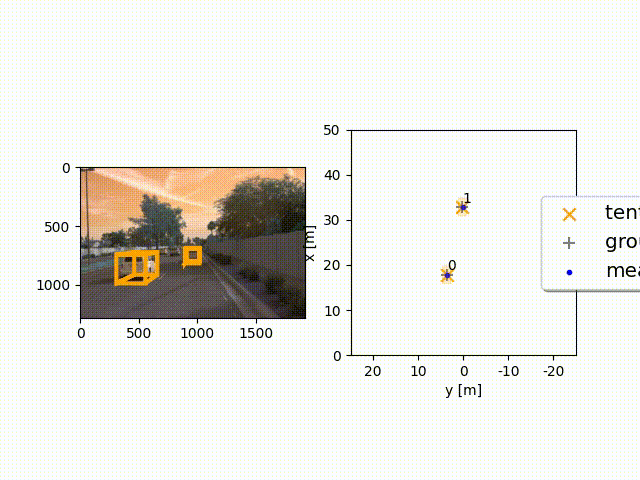

# Project: Multi-Target Tracking with Extended Kalman Filter

**Udacity Self-Driving Car Engineer Nanodegree – Sensor Fusion Module**

---

## Project Overview

### Introduction

  

Multi-target tracking (MTT) with camera-LiDAR sensor fusion

In this project, we developed a sensor fusion system capable of tracking multiple vehicles over time. Using real-world data from the `Waymo Open Dataset`, we fused 3D LiDAR detections with camera-based object detections generated in `Mid Term Project`. These fused observations were processed through a custom-built non-linear `Extended Kalman Filter (EKF)`, paired with a comprehensive track management and data association pipeline. Our system reliably tracked vehicles across suburban scenes under various visibility conditions.

---

### Core Goals

-  Built an Extended Kalman Filter (EKF) to estimate object states from noisy sensor measurements.
-  Implemented a robust track management system for track initialization, confirmation, and deletion.
-  Solved the data association problem using Single Nearest Neighbor (SNN) with validation gating.
-  Applied sensor fusion by integrating LiDAR and camera-based object detections.
-  Evaluated multi-target tracking (MTT) performance using metrics such as RMSE and BEV visualizations.

---

## Key Modules

### 1. Extended Kalman Filter (EKF)
We implemented a nonlinear EKF for state estimation, incorporating custom motion and measurement models, jacobian computation, and process noise modeling.

### 2. Track Management
Track Management system managed full lifecycle of track states including tentative confirmation and pruning of inactive or low-score tracks.

### 3. Data Association
Used Mahalanobis distance with validation gating to associate observations to tracks reliably, reducing mismatches and ID switches.

### 4. Camera-LiDAR Sensor Fusion
Fused bounding boxes from camera and LiDAR using projection matrices and non-linear models to improve spatial accuracy, especially under occlusion / partial visibility.

---

## Project Structure

| Filename                        | Description |
|--------------------------------|-------------|
| `setup.py`                     | Installs the project in editable mode and resolves dependencies. |
| `loop_over_dataset.py`         | Main script to load, visualize, and evaluate tracking over range images. |
| `data/filenames.txt`           | List of `.tfrecord` files used for evaluation. |
| `student/filter.py`            | EKF class with nonlinear predict and update logic. |
| `student/trackmanagement.py`   | Manages track lifecycle including initialization and scoring. |
| `student/association.py`       | Associates measurements to tracks using Mahalanobis distance and gating. |
| `misc/measurements.py`         | Defines sensor models, measurement noise, and coordinate transforms. |
| `misc/params.py`               | Contains system configuration and tuning parameters. |

---

## Results Achieved

- Consistent multi-object tracking with minimal ID switches.
- Low Root Mean Square Error (RMSE) on selected evaluation sequences.
- Improved temporal consistency of object tracks due to fusion and gating logic.
